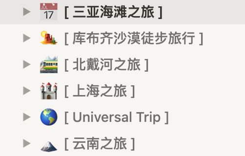

# HowToTravel

程序员旅游出行攻略，2021年算是利用各种小长假游玩了国内热门城市和景点，在Notion中也有针对每次出行做了相对完整的”前期准备“、”游玩行程安排“、”费用预算“等计划，于是乎想到和大家一起分享，计划中做了排坑处理，所以计划中一般来说没有”坑点“且都是自己亲身体验游玩过的，如果游玩过很坑也会进行标注。

同时如果大家有自己旅游攻略，欢迎贡献，一起建设~

---

## 国内旅游

### 北京

- [环球影城](./destination/China/北京环球影城.md)

### 云南

- [大理-丽江-香格里拉-梅里雪山 完整版](./destination/China/云南旅行路线/云南旅行路线.md)

### 海南

- [三亚4日游](./destination/China/海南三亚之旅.md)

---

### 待整理上传攻略

